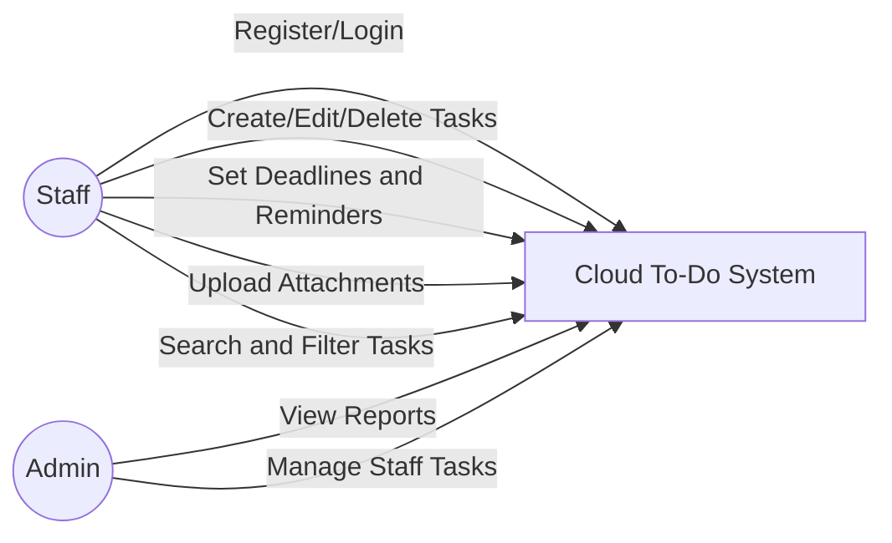
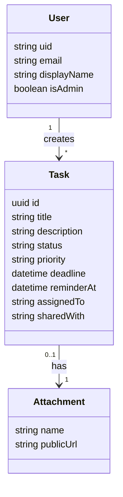
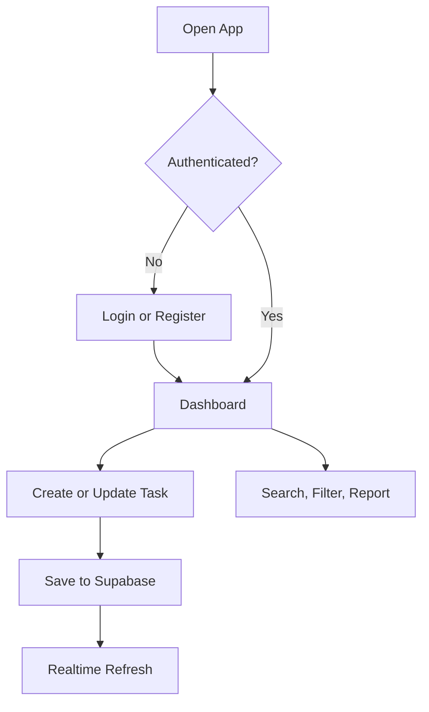
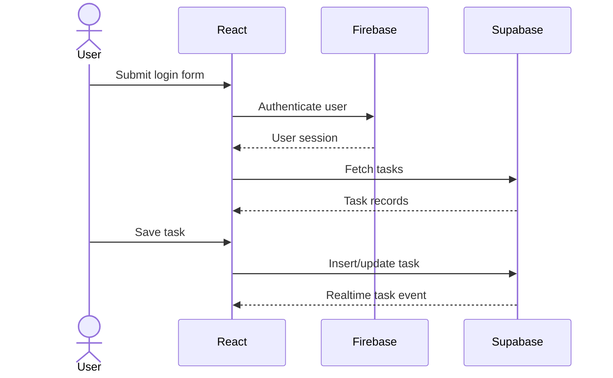
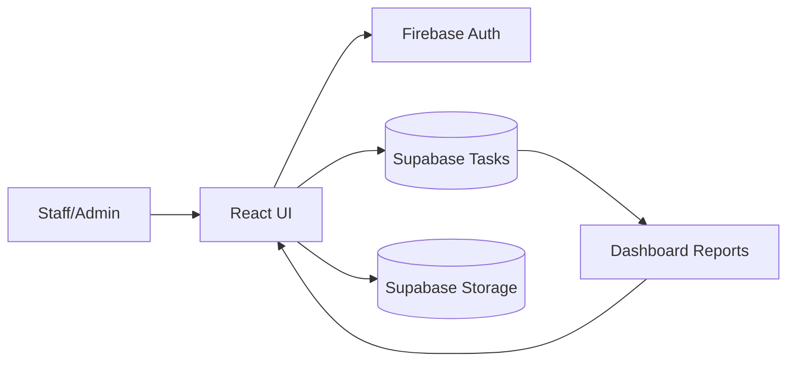
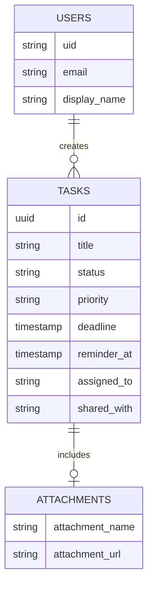

# Precious Cloud Probase Todo

Cloud-based to-do list management system for the Shoprite Nigeria case study. It uses React, Tailwind CSS, Firebase Authentication, and Supabase for task data, realtime updates, reporting, and file attachments.

## Features

- User registration, login, and logout with Firebase Authentication
- Create, edit, delete, search, and filter tasks
- Deadlines, priorities, status tracking, reminders, and browser notifications
- Supabase realtime task refresh and attachment uploads
- Admin/reporting view controlled by `VITE_ADMIN_EMAILS`
- Dashboard analytics for total, completed, due-soon, and overdue tasks
- Dark mode and responsive layouts for mobile and desktop
- Local demo mode when cloud credentials are not configured

## Setup

1. Install dependencies:

   ```bash
   npm install
   ```

2. Copy `.env.example` to `.env` and fill in Firebase and Supabase values.

3. In Supabase SQL Editor, run:

   ```sql
   -- contents of supabase/schema.sql
   ```

4. Start the app:

   ```bash
   npm run dev
   ```

## Cloud Notes

Firebase is used for authentication and optional analytics. Supabase stores tasks, streams realtime updates, and stores task attachment files in the `task-attachments` bucket.

The included Supabase policies are open prototype policies because the app signs users in with Firebase, not Supabase Auth. For production, replace them with Supabase Auth or a Firebase custom JWT bridge so row-level security can verify each user directly.

## Suggested Diagrams

### Use Case Diagram



### Class Diagram



### Activity Diagram



### Sequence Diagram



### Data Flow Diagram



### ERD


